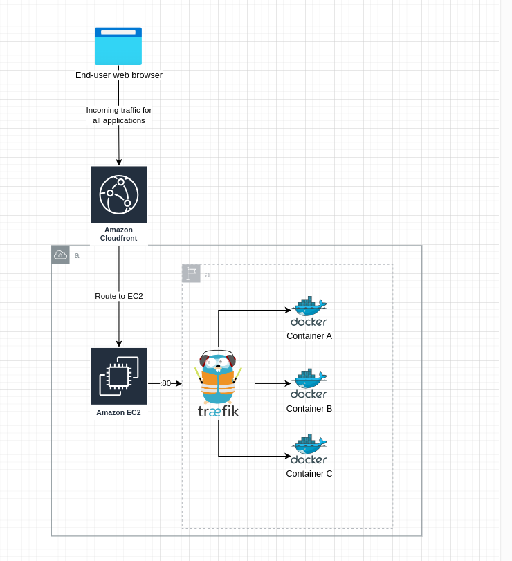

# Dotkom Container Service (Evergreen)

Evergreen is our container service that should be used to run all Monoweb applications in all environments, including
production and staging. Evergreen is based on Docker containers, and we use Docker Compose as the orchestrator.

At its core, Evergreen is a single Traefik reverse proxy, and a set of Docker containers running the various apps that
are part of Monoweb. To keep simplicity low, Evergreen is hosted on a single AWS EC2 instance. Because of this, the
services are not intended to be highly scalable, and should likely be used for smaller applications that we don't mind
small downtimes for.

**Table of Contents**

- [Motivation](#motivation)
- [Service Architecture](#service-architecture)
- [Deployment & Scaling](#deployment--scaling)
- [Pricing](#price)
- [Pitfalls](#pitfalls--alternatives)

## Motivation

The motivation for Evergreen is to provide a really cheap way to run multiple small applications that can tolerate
occasional downtime. Additionally, we want to use Docker as the deployment format. Furthermore, Docker Compose is
relatively simple, and we want to keep deployment complexity low in order to make it easy for new developers to
understand.

The proposed solution has a set of pitfalls outlined in the [Pitfalls & Alternatives](#pitfalls--alternatives) section,
but we believe that keeping things simple and cheap is rather important for a student organization with limited
financial resources.

## Service Architecture

The entire application fleet is hosted on a single AWS EC2 (t4g.medium as of writing) instance. The instance is
available to the public internet through a VPC, but all traffic should be routed from CloudFront to Traefik. Traefik is
responsible for load balancing and routing across the various applications.



<details>
<summary>Why use CloudFront? Can't we just route to EC2?</summary>
We use CloudFront for two primary reasons: CloudFront comes very cheap, and it can be configured to cache and respect
cache headers coming from the applications. This reduces load and bandwidth on the Evergreen instance.

Secondly, you cannot attach AWS ACM Certificates directly to AWS EC2 instances. This means that traditionally, you would
require an ELB to be attached to the EC2 instance, and attach the ACM certificate to the ELB. An ELB comes at a flat
rate of $18/month, and it provides no features that we are interested that are not already available with Traefik.

Because of this, we use CloudFront as an alias to the Evergreen instance, and attach the ACM certificate to CloudFront,
effectively saving us $18/month.
</details>

Each application is packaged as a Docker container that is pushed to AWS ECR. GitHub Actions dispatches from push or
tag release events, and pulls the latest Docker image from ECR, and restarts the relevant containers.

Environment variables are pulled from Doppler and injected into the container through a .env file stored on the
Evergreen instance.

To allow fair share of the instance resources, each container is limited to a subset of the vCPU and memory available on
the instance. This is configured in the Docker compose configuration file. The total amount of vCPU and memory allocated
to instances should not exceed the total amount of vCPU and memory available on the Evergreen instance. If it does,
consider downscaling some services, or upgrading the Evergreen EC2 instance type.

The EC2 instance is an Amazon Linux 2023 AMI, and is built with Packer through the terraform monorepo.

If there is ever a need to scale Evergreen (vertically only), we can do so by re-deploying a new Evergreen instance with
a different instance type. In this case, the CloudFront distribution is updated to alias to the new instance, and the
entire CloudFront distribution is invalidated.

> There is no horizontal scaling of Evergreen, and there is currently no plans to implement it. If it ever becomes a
> requirement in the future, an option is to autoscale Evergreen across an ELB.

**Traefik**

We use Traefik as the routing layer for Evergreen. Traefik is configured with the Docker provider, and uses labels
available from the Docker socket to automatically discover and route containers. Adding new services to Evergreen
is a matter of adding new containers to the docker-compose.yml file, and adding the appropriate labels to the
docker-compose.yml file.

For applications that should communicate locally, we create shared Docker networks between the containers. In addition,
all containers must be configured to use the same Docker network that Traefik is configured to use.

```yaml
services:
  gradestatsweb-prod:
    image: 891459268445.dkr.ecr.eu-north-1.amazonaws.com/gradestats-web-prd:latest
    container_name: gradestatsweb-prod
    env_file:
      - files/grades-prod.env
    ports:
      - "3000:3000"
    deploy:
      resources:
        limits:
          cpus: '0.5'
          memory: 512M
    networks:
      - traefik
      - gradestats
    labels:
      - "traefik.enable=true"
      - "traefik.http.routers.gradestatsweb-prod.entrypoints=web"
      - "traefik.http.routers.gradestatsweb-prod.rule=Host(`grades.no`) || Host(`grades.localhost`)"
      - "traefik.http.routers.gradestatsweb-prod.service=gradestatsweb-prod"
      - "traefik.http.services.gradestatsweb-prod.loadbalancer.server.port=3000"

networks:
  traefik:
    driver: bridge
  gradestats:
    driver: bridge
```

## Deployment & Scaling

Deployment must be fully automated, and should be done through GitHub Actions. Dotkom releases two environments for each
application; staging and production. The staging environment should be deployed upon push to the `main` branch for the
relevant repository, and the production environment should be deployed upon a tag release to the same repository.

This ensures the entire deployment process is automated, and can be done without developer involvement. Evergreen is
a standard EC2 instance, and we will allow GitHub Actions to SSH into the instance to run the deployment steps.

**Deployment Steps**

1. GitHub Actions builds the Docker image and pushes it to AWS ECR.
2. GitHub Actions accesses Evergreen via SSH
3. Pull the Docker image from ECR
4. Re-fetch the latest environment variables for the application from Doppler
5. Restart the containers that are used by the application

Deployment will be done through a set of bash scripts that are developed in the terraform monorepo and copied over to
the AWS AMI that Evergreen runs on.

**Re-deploying Evergreen**

Each time an application is added to Evergreen, or the docker-compose.yml file is updated, the Evergreen instance must
be re-deployed. This can be automatically done by Terraform by re-building the Packer AMI, and re-deploying the EC2
instance with the new AMI.

- Update configuration in Terraform monorepo / docker-compose.yml
- Re-build Packer AMI
- Deploy new EC2 instance with new AMI
- Route CloudFront to the new EC2 instance and invalidate the entire distribution
- Destroy old EC2 instance

All applications can be served through Traefik, and should be tagged in the `docker-compose.yml` file with the necessary
Traefik labels for Traefik to automatically pick up.

The same steps should be applied when the Evergreen instance is scaled up or down. This can be done by re-deploying the
instance with the new AMI, as the instance type is configured in the Packer template and `aws_instance` resource.

## Price

The application fleet should stay relatively cheap, as we run many applications on a single host in order to maximize
usage of the instance. The price of the Evergreen instance is based on the following factors:

- Instance type: t4g.medium
- Static IPv4 address
- EBS Storage on the instance (should be limited)
- CloudFront (practically free)
- Additional costs for VPC, Route53, other related services

## Pitfalls & Alternatives

Evergreen is a single instance, meaning there is a single point of failure for the entire application fleet. If the
instance is down, all applications will be down. This should not be a very big problem for a student organization like
ours. However, it is important to keep in mind that the instance is not intended to be highly scalable, and should
likely be used for smaller applications that we don't mind small downtimes for.

Whenever we want to scale up (Åre påmelding), we should deploy a new Evergreen instance.

We believe that the drawbacks are acceptable for our use case.

**Alternatives**

- **AWS ECS on Fargate**: We tried to run ECS as the Docker orchestrator, but its prices are too high to justify using
  it for all of our applications across multiple environments.
- **AWS Lightsail**: We tried to use Lightsail, but the logs disappear at random times, and there is no built-in
  log driver, making it difficult to troubleshoot issues. It also has a very annoying Terraform experience, and we
  also found it a bit too expensive for the problem it attempts to solve.
- **Kubernetes / AWS EKS**: The added complexity with a control plane and several other services are not beginner
  friendly, and we don't have the experience to run it properly. Additionally, EKS is extremely expensive and will break
  our budget alone.
- **AWS Lambda**: Lambda is cool for smaller applications, but it has its own set of problems. It's also less
  predictable although highly scalable. Not all our applications are suited to run on Lambda without causing a lot of
  latency in cold starts.
- Linux VMs: We believe that the proposed solution allows for a better separation of applications, and is more relevant
  than raw-dogging Linux on self-managed VMs. We also require good Terraform support for our applications, and using
  VMs from providers like Hetzner would be more troublesom in this regard.
