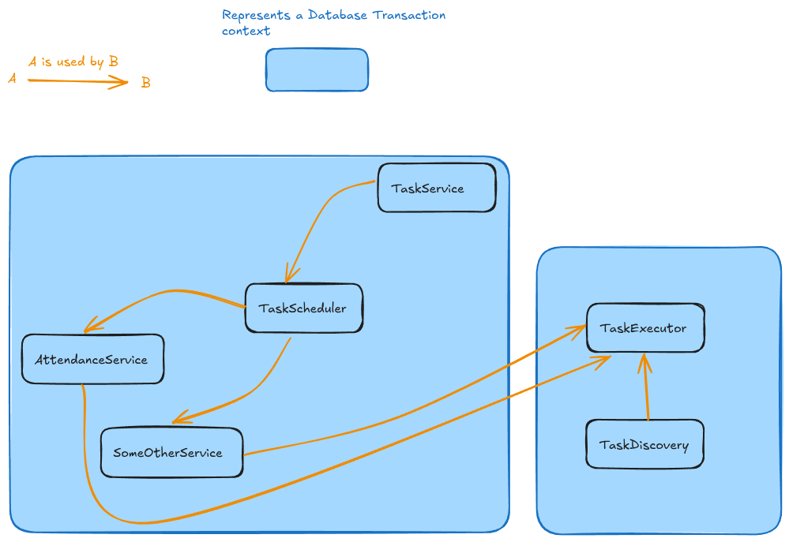
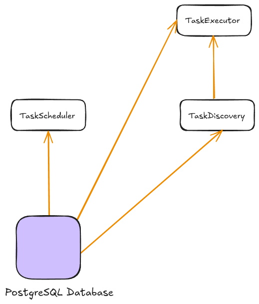
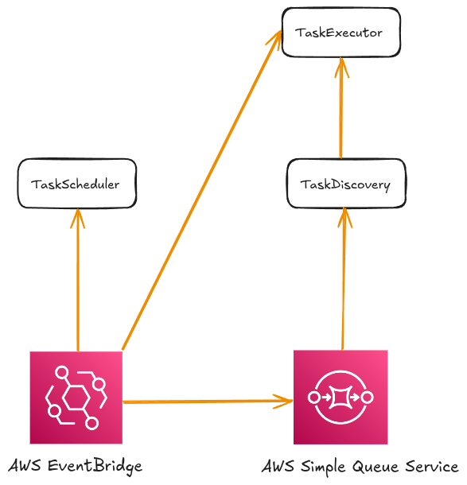

# Task Infrastructure System Design

> Parts of this document was transcribed from audio using Whisper. The text might not read perfectly.

This document describes the task infrastructure system in Monoweb, which is responsible for scheduling and executing
"tasks". The following image depicts the overall system architecture and the boundaries.

An important part of the task service is keeping track of which database transactions are used where. For reference, a
database transaction is a rollbackable SQL query. This means that we can perform some queries, and if some precondition
fails somewhere, we can roll back everything that has been done. This is useful for keeping a system state consistent
and to prevent unexpected states in our database. The event system runs in two different transaction contexts. One is
the callers, seen on the left, and another is the executor itself, seen on the right.

Whenever a service call comes in to schedule a task, say somebody has registered a new event, their call runs in a
separate database transaction started at the router itself. This means that they may schedule as many tasks as they want
on our task scheduler, and if
something happens to go wrong later on in that call, the entire database change can be rolled back to before the request
began. This is important so we don't schedule tasks that will eventually fail because something else failed when the
task was scheduled.

The second transaction context is within the task executor itself. When the task executor wants to
execute a task, it creates a new database transaction for the task itself. This means that the code that a job might run
will be ran inside its own database transaction. Another implementation detail of the task executor is that updating the
state of the task, whether the task has completed, it's currently running, or failed, is ran outside of this transaction
so that we guarantee that regardless if the task itself rolls back, the state of the job is always updated.

## Components

So the event system effectively has five components.

1. The TaskService that is primarily used by the local backends to persist the tasks that have been registered. The task
   service is also responsible for ensuring that the payload data that is sent to a task is valid according to that
   task's definition.
2. The TaskScheduler is a component that allows a caller to schedule a task to be executed at some point in the future.
   The scheduler supports both regular jobs that run on an interval and one-off jobs that run at a specific set point in
   time. An example use of the task scheduler involves the attendance service wanting to merge the attendance pools of
   an event. Because this operation happens at a fixed time, for example, one day before the event starts, the
   attendance service needs to register a task on the scheduler to merge the pools at that point in the future. We may
   also want to send weekly newsletters to every single member. To do this, we could specify a newsletter service that
   schedules a task that runs every Monday to gather an overview of the coming events and construct an email to send to
   all of our users.
3. TaskDiscovery is the component that determines which tasks are supposed to run right now. As tasks are scheduled, we
   run an interval to see how often we try to execute tasks. Therefore, the precision of task execution is not fully
   guaranteed and may vary based on how the executor is configured. Task discovery is responsible for querying the
   database or polling an external queue to determine which tasks are ready for execution.
4. The TaskExecutor receives the tasks from the discovery component and actually performs the jobs.

## Supported Backends

We have built two implementations of the task system. The reason is because we believe that production has significantly
higher stakes, and we want to guarantee correctness. For this reason, we have the local Postgres database, which will be
used for task execution when you run the application locally, when you're developing. And then we have the Amazon AWS
EventBridge and SQS setup for production.

- Scheduling and discovery through the local PostgreSQL database
- Scheduling on AWS EventBridge Scheduler, and discovery through AWS SQS

### Local PostgreSQL Backend

As seen in the diagram, the Postgres database is used by absolutely everything in the task system. Whenever the task
scheduler has a new task it wants to schedule, it creates a new record in the Postgres database under the task table.
Task discovery reads from this table to determine the available jobs and forwards them to the task executor. When the
task executor has finished a task, it will then update the database and mark the job as either completed or failed based
on the job outcome.

### AWS EventBridge + SQS Backend

In the case for the AWS backed system, we use two different services. I'll give a quick introduction to the services.
But for a deeper understanding, I suggest you read upon each of the service individually on your own.

EventBridge scheduler is an event-driven serverless service that allows you to schedule things to happen at either a
given schedule,
such as every Friday at five in the evening, or at a given point in time, like in two weeks and five hours from now.
EventBridge is able to send the events when they trigger to other services within AWS.

Amazon Simple Queue Service is a
simple data buffer that acts like a queue. Consumers are able to push messages on to the queue. And then a single
consumer will read each message, process it and acknowledge it. SQS comes in two flavors, standard and
first-in-first-out. A guarantee with first-in-first-out queues on Amazon SQS is that each message is delivered exactly
once. This is very crucial in our system, where we want a way to guarantee that a message is processed at least once,
regardless of how bad our system is acting.

As you can see in the diagram, when a scheduler is scheduling a new task, it
sends an API call to Amazon EventBridge. When the task is supposed to be executed, Amazon EventBridge will send the
message on to an Amazon SQS queue. The task discovery implementation for Amazon SQS will call the SQS queue for new
messages. If any new messages are found, they're forwarded to the task executor, as we did in the local implementation
as well.

**NB:** An important detail when working with EventBridge is that your build for however many schedules are active on
your account, which means that if we don't have persistent jobs, in other words, if we have one-time jobs, such as
merging an event pool, it's important that we delete the EventBridge schedule after we've executed the task. Otherwise,
we will just keep on getting build for that one job that has already finished. For this reason, the task executor will
make a call to Amazon EventBridge and delete the schedule once everything is completed.

